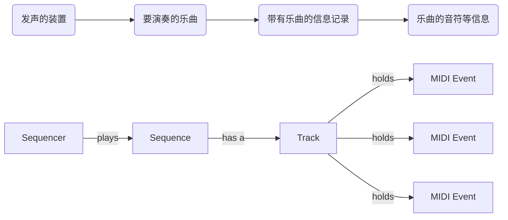

# Head First Java

## 进入Java的世界

#### Java的优点

友好的语法、面向对象、内存管理、跨平台可移植性

#### Java的工作方式

1. 编写源代码 存为.java格式
2. 执行javac程序来编译.java文件 如果编译通过会产生.class文件
3. 启动Java虚拟机（JVM）来运行.class文件

#### Java有三种循环：

while循环、do-while循环、for循环

#### Q:Java可以这么写吗？

```java
int x = 1;
while(x){}
```

A:不行

## 拜访对象村

+ 面向对象设计扩展程序不需要改动之前已经测试好的程序代码

+ 所有的Java程序都定义在类中

+ 类如同蓝图描述该类型的对象要如何创建

+ 对象自洽；你无需在意它如何完成任务

+ Java的程序在执行期是一组会互相交谈的对象

#### 为什么要继承？

从前有两个程序员被指派去设计一个程序，程序的要求是这样的：
**在图形接口画出四方形、圆形与三角形。当用户点击图像时，图像需要顺时针选择360°并根据形状的不同播放不同的AIF音效文件。**

程序员阿珠是这样写的：

```java
rotate(shapeNum){
    //旋转360°
}
playSound(shapeNum){
    //查询播放哪个AIF文件
    //播放
}
```

程序员阿花是这样写的：

```java
class Square{
    rotate(){
        //四方形旋转代码
    }
    playSound(){
        //播放四方形音效文件
    }
}
class Circle{
    rotate(){
        //圆形旋转代码
    }
    playSound(){
        //播放圆形音效文件
    }
}
class Triangle{
    rotate(){
        //三角形旋转代码
    }
    playSound(){
        //播放三角形音效文件
    }
}
```

正当阿珠心想自己赢定了时，老板说规则改了……
**加上阿米巴原虫形状，用户点击时也是旋转并播放hif声音文件**

阿珠的修改：

```java
playSound(shapeNum){
    if(不是阿米巴原虫){
        //查询播放哪个AIF文件
        //播放
    }else{
        //播放hif声音文件
    }

}
```

阿花的修改：
**面向对象最让她喜欢的一点就是有时不需要动到已经测试好的程序**

```java
class Amoeba{
    rotate(){
        //阿米巴原虫旋转代码
    }
    playSound(){
        //播放阿米巴原虫音效文件
    }
}
```

这时老板失望的说：“不对啊，阿米巴原虫不是这样旋转的……”
原来两个人都把旋转写成这样：
**找出指定形状的中心点，以此点为轴旋转。**
但是老板认为阿米巴原虫应该：
**绕着一端旋转，类似秒针那样**

于是：

阿珠的修改：

```java
rotate(shapeNum){
    if(不是阿米巴原虫){
        //计算中心点
        //旋转
    }else{
        //以其中一端为轴
        //旋转
    }

}
```

阿花的修改：

```java
class Amoeba{
    rotate(){
        //修改阿米巴原虫旋转代码
    }
    playSound(){
        //播放阿米巴原虫音效文件
    }
}
```

阿珠：“你有重复的程序代码，这样一来你必须同时维护四个不同的rotate方法。这一点效率都没有”
阿花：“你一定没看到最终的设计，这叫面向对象的继承（inheritance）”


#### 当你设计类时有哪些基本的事项需要考虑？

1. 对象已知的事务 可以被称为**实例变量**

2. 对象会执行的动作 可以被称为**方法**

### main的的两种用途：

+ 测试真正的类

+ 启动Java应用程序

## 认识变量

+ 变量有两种： primitive主数据类型和引用

+ 变量的声明必须有类型和名称

+ primitive主数据类型变量值是该值的字节所表示的

+ 引用变量的值代表位于堆之对象的存取方法

+ 引用对象如同遥控器

+ 没有引用到任何对象的引用变量的值为null

+ 数组一定是个对象，不管所声明的元素是否为primitive主数据类型。

+ 没有primitive主数据类型的数组，只有装载primitive主数据类型的数组。

#### 引用变量

引用变量保存的是存取对象的方法

它并不是对象的容器，而是类似指向对象的指针。

#### 对象的声明与赋值步骤：

Dog myDog = new Dog();

1. 声明一个引用变量 
   
   Dog myDog
   
   要求Java虚拟机分配空间给引用变量，并将此变量命名为myDog。

2. 创建对象
   
   new Dog()
   
   要求虚拟机分配堆空间给新建立的Dog对象

3. 连接对象和引用
   
   =
   
   将Dog赋值给myDog这个引用的变量。

#### 数组

数组也是对象，不管里面放的是不是primitive主数据类型

## 对象的行为

+ 方法可根据实例变量来展现不同的行为

+ 方法无法改变调用方所传入的参数

+ 封装的基本原则：将你的实例变量标记为私有的，并提供公有的getter和setter来控制存取动作

+ 实例变量永远都会有默认值；局部变量没有默认值，在初始化之前调用编译器会报错。

#### 封装的作用

强迫其他程序一定得经过setter，如此setter就能够检查参数并判断是否可以执行。setter也许可以退回不合理的值，或是抛出Exception，或者自己进行取小数点的动作。

## 超强力方法

+ 你的Java程序应该从高层的设计开始。

+ 你通常会在创造新的类时写出下列三种东西：
  
  + 伪码
  
  + 测试码
  
  + 真实码

+ 伪码应该描述要做什么事情而不是如何做。

+ 使用伪码来帮助测试码的设计。

+ 实现方法之前应该要编写测试码。

+ 如果知道要执行多少次，应该要使用for循环而不是while循环

#### 开发类步骤

+ 找出类应该做的事情

+ 列出实例变量和方法

+ 编写方法的伪码

+ 编写方法的测试用程序

+ 实现类

+ 测试方法

+ 除错或重新设计

#### 极限编程（XP）

极限编程（XP）是一种新型的软件开发方法论。

XP是由一组被证明有效的施行方法所组成的，这些方法都是被设计来共同运作，但是许多人只选择性地实行部分的XP规则。这些方法包括了：

1. 多次经常性的小规模发布。

2. 避免加入规格没有的功能。

3. 先写测试用的程序。

4. 正常工作上下班。

5. 随时随地重构（refactor），也就是改善程序代码。

6. 保持简单。

7. 双双结伴工作，并经常交换结伴对象，以便让大家都清楚全局。

#### for循环与while循环的差别

while循环适合用在不知道要循环几次的循环上，若你指定要执行几次，使用for循环会比较容易阅读。  

## 使用Java函数库

+ ArrayList只能携带对象而不是primitive主数据类型，但编译器能够将primitive主数据类型包装成Object存放在ArrayList中。

+ java.lang是个预先被引用的包，无需import，除此之外的包都需要引用。

#### 长运算符（&,|）

&与|运算符使用在boolean表达式时会强制Java虚拟机一定要计算运算符两边的算式。但这两个运算符通常是用来作位的运算。

#### javax开头的包代表什么？

在Java的早期两个版本中，所有附随于Java的类（也就是standard library）都是放在java开通的包中，包括java.lang、java.io、java.util等。

后来出现了一些没有包含在标准函数库中的包。被Sun认可的称为standard extension，这些包都以javax作为包名称的开头。

## 对象村的优质生活

+ 子类会继承父类所有public类型的实例变量和方法，但不会继承父类所有private类型的变量和方法。

+ 继承下来的方法可以被覆盖掉，但实例变量不能被覆盖掉。

+ 使用IS-A测试来验证继承结构的合理性，如果两者间不能通过IS-A测试就不要应用继承关系。

#### 设计继承层次

1. 找出具有共同属性和行为的对象

2. 设计代表共同状态与行为的类

3. 决定子类是否需要让某项行为（也就是方法的实现）有特定不同的运作方式

4. 通过寻找使用共同行为的子类来找出更多抽象化的机会

5. 完成类的继承层次

#### 如果在子类中打算引用父类的方法然后加上格外的行为应该怎么办？

可以通过super这个关键字类取用父类

```java
public void roam(){
    super.roam();
    //其他行为
}
```

#### 多态

+ 运用多态时，引用类型可以是实际对象的父类
  
  Animal myDog = new Dog();
  
  在调用共有的方法时会使用Dog的方法。

+ 参数和返回类型也可以多态
  
  ```java
  public void giveShot(Animal a){
      a.makeNoise();
  }
  
  ————
  Dog d = new Dog();
  Hippo h = new Hippo();
  giveShot(d);//会执行Dog的makeNoise
  giveShot(h);//会执行Hippo的makeNoise
  ```
- 通过多态，可以编写引进新型子类时也不必修改的程序

#### 如何防止某个类被作出子类？

1. 存取控制 非公有的类只能被同一个包的类作出子类

2. 使用final修饰符

3. 让类只拥有private的构造程序（constructor）

#### 覆盖的规则

1. 参数必须一样，且返回类型必须兼容

2. 不能降低方法的存取权限

## 深入多态

- 如果不想让某个类被初始化，就以abstract这个关键词将它标记为抽象的

- 抽象的类可以带有抽象和非抽象的方法

- 如果类带有抽象的方法，则此类必定标识为抽象的

- 抽象的方法必须在具体的类中运行

- 不管实际上引用的对象是什么类型，只能调用引用变量的类型中的方法

编译器是根据引用类型来判断有哪些method可以调用，而不是object具体的类型。

可以强制转换回具体的类型，不会丢失数据

- class可以实现多个接口

- 实现某接口的类必须实现它所有的方法，因为这些方法都是public与abstract的

- 要从子类调用父类的方法可以用super这个关键词

- 不是抽象的类被称为具体类

- 如果父类实现了接口，那么子类自然也实现了该接口

#### 为什么要有抽象的方法？这样做的好处是？

抽象方法的意义是就算无法实现出方法的内容，还是可以定义出一组子型共同的协议。

这样做的好处就是多态。想要达成的目标是要使用父型作为方法的参数、返回类型或数组的类型。

#### Object这个类是抽象的吗？

不是。

#### Object的主要目的是什么？

主要有两个目的：作为多态让方法可以应付多种类型的机制，以及提供Java在执行期间对任何对象都有需要的方法的实现程序代码。

#### 致命方块是什么？为什么多重继承会导致致命方块？

CDBurner和DVDBurner都继承自DigitalRecorder,且两者都覆盖过burn()方法，也都有i这个实例变量。ComboDriver在调用burn()方法时到底要运行哪个版本？

#### 如何判断应该是设计类、子类、抽象类或者接口？

- 类：新的类无法对其他类通过IS-A测试

- 子类：需要某些类的特殊化版本

- 抽象类：需要定义一群子类的模板，又不想让程序员初始化此模板时

- 接口：定义出类可以扮演的角色

## 对象的前世今生

- 实例变量保存在所属的对象中，位于堆上

- 如果实例对象是个对对象的引用，则引用和对象都在堆上

- 所有局部变量都存在于栈上相对应的堆栈块中

对象引用变量与primitive主数据类型变量都是放在栈上

- 不管是实例变量还是局部变量，对象本身都在堆上

#### 在创建有父类的新对象时，构造函数的执行顺序是什么？

在创建新对象时，所有继承下来的构造函数都会执行。执行顺序是从父类到子类。

父类被调用的会是无参数的构造函数版本。

如果没有无参数版本，需要传值进去：`super(name)`。如果不能传值进去，则不能被继承。

#### 如何从某个构造函数调用重载的另一个构造函数？

只要调用`this()`或者`this(aString)`就行。`this()`只能用在构造函数中，而且它必须是第一行语句。

每个构造函数可以选择调用`super()`或`this()`，但不能同时调用。

#### 对象与变量的生命周期是什么？

对象生命周期要看引用变量的生命周期。如果没有指向对象的引用，那么对象也会被回收。

局部变量只会存活在声明该变量的方法中。

实例变量的寿命与对象相同，如果对象还活着，则实例变量也是活着的。

## 数字很重要

+ 静态方法不能调用非静态的方法

+ 静态方法不能调用非静态变量

+ 如果类只有静态的方法，你可以将构造函数标记为private的以避免被初始化

+ 静态变量会在该类的任何静态方法执行前就初始化

+ final的静态变量值必须在声明或静态初始化程序中赋值

+ final值一旦被赋值就不能更改

+ final的方法不能被覆盖

+ final的类不能被继承

#### 以下哪些代码是合法的？

```java
    //    可以通过编译
        public class Foo{
            static int x;
             public void go(){
                 System.out.println(x);
             }
        }

    //    static方法取不到非静态的值
        public class Foo2{
            int x;
            public static void go(){
                System.out.println(x);
            }
        }

    //    x没有赋值
        public class Foo3{
            final int x;
            public void go(){
                System.out.println(x);
            }
        }

    //    可以通过编译
        public class Foo4{
            static final int x = 12;
            public void go(){
                System.out.println(x);
            }
        }

    //    可以通过编译
        public class Foo5{
            static final int x = 12;
            public void go(final int x){
                System.out.println(x);
            }
        }

    //    可以通过编译
        public class Foo6{
            int x = 12;
            public static void go(final int x){
                System.out.println(x);
            }
        }     
```

#### 可以直接声明ArrayList\<int\>吗？

泛型（generic）的规则是你只能指定类或者接口类型。因此ArrayList\<int\>无法通过编译。

#### 这段代码可以通过编译吗？执行会有什么结果？

```java
public class TestBox {
    Integer i;
    int j;

    public void go() {
        j = i;
        System.out.println(j);
        System.out.println(i);
    }

    public static void main(String[] args) {
        TestBox t = new TestBox();
        t.go();
    }
} 
//可以编译 运行会报空指针 
```

#### 数字的格式化

```java
%[argument number][flags][width][.precision]type
//[argument number] 如果要格式化的参数超过一个以上，可以在这里指定
//[flags] 指定类型的特定选项
//[width] 最小的字符数，输出可以超过此宽度，不足会自动补足
//[.precision] 精确度
//type 指定的类型标识
format("I hava %.2f bugs to fix.", 476578.09876)
//I hava 476578.10 bugs to fix.
```

| 转  换  符 | 说    明                 | 示    例       |
| ------- | ---------------------- | ------------ |
| %s      | 字符串类型                  | "mingrisoft" |
| %c      | 字符类型                   | 'm'          |
| %b      | 布尔类型                   | true         |
| %d      | 整数类型（十进制）              | 99           |
| %x      | 整数类型（十六进制）             | FF           |
| %o      | 整数类型（八进制）              | 77           |
| %f      | 浮点类型                   | 99.99        |
| %a      | 十六进制浮点类型               | FF.35AE      |
| %e      | 指数类型                   | 9.38e+5      |
| %g      | 通用浮点类型（f和e类型中较短的）      |              |
| %h      | 散列码                    |              |
| %%      | 百分比类型                  | ％            |
| %n      | 换行符                    |              |
| %tx     | 日期与时间类型（x代表不同的日期与时间转换符 |              |

| 标    志 | 说    明                          | 示    例                         | 结    果           |
| ------ | ------------------------------- | ------------------------------ | ---------------- |
| +      | 为正数或者负数添加符号                     | ("%+d",15)                     | +15              |
| −      | 左对齐                             | ("%-5d",15)                    | \|15   \|        |
| 0      | 数字前面补0                          | ("%04d", 99)                   | 0099             |
| 空格     | 在整数之前添加指定数量的空格                  | ("% 4d", 99)                   | \|  99\|         |
| ,      | 以“,”对数字分组                       | ("%,f", 9999.99)               | 9,999.990000     |
| (      | 使用括号包含负数                        | ("%(f", -99.99)                | (99.990000)      |
| #      | 如果是浮点数则包含小数点，如果是16进制或8进制则添加0x或0 | ("%#x", 99)<br><br>("%#o", 99) | 0x63<br><br>0143 |
| <      | 格式化前一个转换符所描述的参数                 | ("%f和%<3.2f", 99.45)           | 99.450000和99.45  |
| $      | 被格式化的参数索引                       | ("%1$d,%2$s", 99,"abc")        | 99,abc           |

#### 日期的格式化与操作

| 转  换  符 | 说    明                | 示    例                      |
| ------- | --------------------- | --------------------------- |
| c       | 包括全部日期和时间信息           | 星期六 十月 27 14:21:20 CST 2007 |
| F       | “年-月-日”格式             | 2007-10-27                  |
| D       | “月/日/年”格式             | 10/27/07                    |
| r       | “HH:MM:SS PM”格式（12时制） | 02:25:51 下午                 |
| T       | “HH:MM:SS”格式（24时制）    | 14:28:16                    |
| R       | “HH:MM”格式（24时制）       | 14:28                       |

```java
String.format("%tc",new Date());
//Sun Nov 28 14:52:41 MST 2004
String.format("%tr",new Date());
//02:25:51 PM
Date today = new Date();
String.format("%tA %tB %td",new Date());
//Sunday November 28
```

## 有风险的行为

+ 异常是Exception类型的对象

+ 编译器不会注意RuntimeException类型的异常。RuntimeException不需要声明或者包在try/catch的块中

+ 可能会抛出异常的方法必须声明成throws Exception

+ 有多个catch块时要从小排到大

#### JavaSound API

JavaSound被分为两个部分：MIDI和取样（sampled）

MIDI代表musical instrument digital interface，也是不同电子发声装置沟通的标准协议。MIDI本身不带有声音，它带的是有MIDI播放功能装置的指令。

以下是JavaSound的工作原理:



##### 实际发声的4个步骤：

```java
//1.取得Sequencer并将它打开
Sequencer player = MidiSystem.getSequencer();
player.open();
//2.创建新的Sequence
Sequence sequence = new Sequence(Sequence.PPQ, 4);
//3.从Sequence中创建新的Track
Track track = sequence.createTrack()
ShortMessage a = new ShortMessage();
a.setMessage(ShortMessage.NOTE_ON, 1, 60, 100);
//4.填入MidiEvent并让Sequencer播放
MidiEvent noteOn = new MidiEvent(a, 1);
track.add(noteOn);
player.setSequence(sequence);
player.start();
```

##### MidiEvent的Message

```java
//信息的格式
a.setMessage(144,1,44,100);
//类型 频道 音符 速率
//第一个字符代表信息类型 如144代表播放某音符 128表示停止 192表示改变乐器
//每个频道代表不同的演奏者
//0-127代表不同音高 通常使用69表示标准音 A4（440 Hz）
//音高值增减一，就增减一个半音。 比如 60 表示 C4（中央 C）， 61 表示 C#4。
//在最基础的合成器中，速率仅用于确定弹奏音符的力度，唯一的效果是音符音量变大或变小。

//改变音长
//对NOTE OFF的事件作些音长的变化 3代表音长
b.setMessage(128,1,44,100);
MidiEvent noteOff = new MidiEvent(b,3);

//改变乐器
first.setMessage(192,1,41,0);
//192代表改变乐器
//41代表小提琴
```

## 保存对象

+ 你可以通过序列化(serialization)来存储对象的状态

+ 使用ObjectOutputStream来序列号对象（java.io）

+ Stream是连接串流或是链接用的串流

+ 连接串流用来表示源或目的地、文件、网络套接字连接

+ 链接用串流来衔接连接串流

+ 用FileOutputStream链接ObjectOutputStream来将对象序列化到文件上

+ 调用ObjectOutputStream的writeObject来将对象序列化，不需要调用FileOutputStrem的方法

+ 对象必须实现序列化这个接口才能被序列化。如果父类实现序列化，则子类就自动实现

+ 当对象被序列化时，它的实例变量所引用的对象也会被序列化

+ 如果有不能序列化的对象，执行期间会抛出异常

+ 除非该实例变量被标记为transient。否则，该变量在还原的时候会被赋予null或primitive主数据类型的默认值

+ 在解序列化时，所有的类都必须能让Java虚拟机找到

+ 读取对象的顺序必须与写入的顺序相同

+ readObject()的返回类型是Object，因此解序列化回来的对象还需要转换成原来的类型

+ 静态变量不会被序列化，因为所有对象都是共享同一份静态变量值

#### 数据在串流中移动

一般来说，串流要两两连接才能作出有意义的事情，其中一个表示连接，另一个则是要被调用方法的。

##### 为何不用单一的串流？

考虑到面向对象设计，每个类只要做好一件事。比如：

FileOutputStream把字节写入文件。ObjectOutputStream把对象转换成可以写入串流的数据。当我们调用ObjectOutputStream的writeObject时，对象会被打成串流送到FileOutputStream来写入文件。

## 网络联机

## 数据结构

## 发布程序

## 分布式计算

## 程序料理决定版

## 十大遗珠之憾

## 索引
